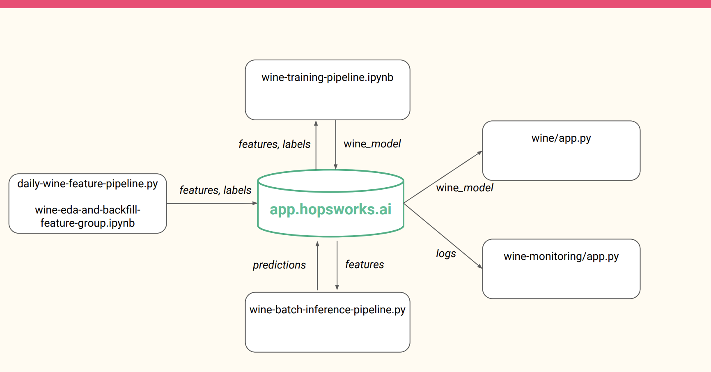

# Wine Quality
### ML system for detecting wine quality.
Project consists of 6 different section. 

###  1- wine-eda-backfill-feature-group.ipynb
This section is for feature selection
and imputation. The most important 10 columns
are chosen for feature group. The empty values are 
replaced with the mean value of the column.

###  2- wine-training-pipeline.ipynb
Feature group from hopsworks is used to train 
a model. A good number of models are trained 
the best results are obtained using XGBClassifier.
Weighted F1 Score is used for metric as the data is 
skewed. We get an F1-score of 0.55 on the best model.
The model is uploded to hopsworks model registry.

###  3- wine-feature-pipeline-daily.py
This python script is used to create artificial
features every day. It chose a random wine quality.
Depending on this quality it creates random values using
normal distribution for every feature then upload the 
artificial wine to the feature group.

###  4- wine-batch-inference-pipeline.py
This python script is used to make predictions. The model
for wine quality is read from the hopsworks alongside with
the feature group.The latest wine features created by step 3 
is predicted. It saves the latest results to a .txt file and 
upload it to hopsworks.

### 5- [Wine](https://huggingface.co/spaces/nelanbu/wine_quality)

Gradio app for getting the inputs. It uses the saved model 
on hopswoks and predict the result for given features.

### 6- [Wine Monitor](https://huggingface.co/spaces/Kiwipirate/wine-monitor)

Gradio app for displaying the latest prediction versus the 
real label. It also displays recent predictions in a table.
A confusion matrix is provided for assessment of the model.

